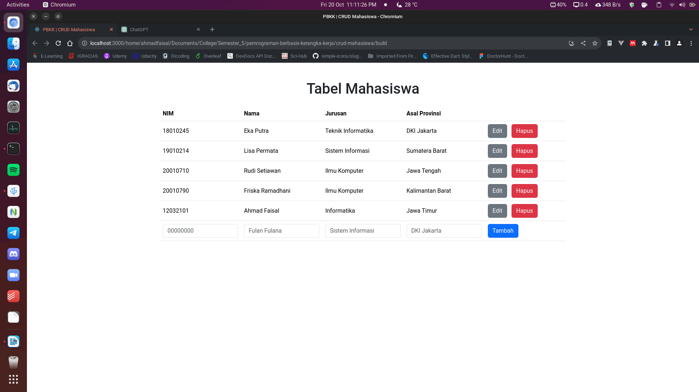

# Praktikum Modul 4 - CRUD Mahasiswa

| Nama | Ahmad Mu'min Faisal |
| -- | -- |
| NIM | 1203210101 |
| Kelas | IF-01-03 |

## 1. Pendahuluan

Pada praktikum kali ini kita akan membuat CRUD Mahasiswa. Dalam programming, CRUD merupakan singkatan dari Create Read Update dan Delete. Yakni aplikasi yang berisi pengolahan data. Biasanya CRUD butuh database sebagai media penyimpanan. Akan tetapi untuk menyingkat pembahasan dan agar kita bisa lebih fokus ke kode React, CRUD ini hanya disimpan di memory saja (state).

Hasil akhir aplikasi tersebut dalam dilihat seperti gambar di bawah ini.


## 2. Source Code

Sebelum menuliskan source code, buat project React terlebih dahulu dengan perintah:

```bash
npx create-react-app crud-mahasiswa
```

Kemudian, masuk ke direktori project:

```bash
cd crud-mahasiswa
```

Setelah itu, jalankan perintah untuk menjalankan project React dalam lingkungan pengembangan (*development environment*):

```bash
npm run start
```

### 2.1 Component

#### 2.1.1 RowMahasiswa

Komponen ini adalah komponen yang menampilkan barisan data mahasiswa. Dalam setiap barisnya, terdapat data mahasiswa (NIM, Nama, Jurusan, dan Asal Provinsi) dan tombol "Edit" dan "Hapus".

Ketika tombol "Edit" di-click, maka input text akan dibuka untuk melakukan replace data dari data yang sedang diedit. Sedangkan, ketika tombol "Hapus" di-click, maka state dari aplikasi akan berubah karena terjadi pemanggilan `setState` di parent componentnya. 

File `components/RowMahasiswa.js`:

```jsx
import React, { useState } from "react";

const RowMahasiswa = (props) => {
  // simpan props mahasiswa ke dalam state agar mudah diakses
  const [formInput, setFormInput] = useState({
    nim: props.mahasiswa.nim,
    nama: props.mahasiswa.nama,
    jurusan: props.mahasiswa.jurusan,
    asalProvinsi: props.mahasiswa.asalProvinsi,
  });

  // state untuk menampung pesan error
  const [errors, setErrors] = useState({
    nama: "",
    jurusan: "",
    asalProvinsi: "",
  });

  // state untuk penanda "Edit mode"
  const [editStatus, setEditStatus] = useState(false);

  // state untuk menampung nilai form sebelum "Edit mode"
  const [dataReset, setDataReset] = useState({});

  // function untuk membuat 2 ways binding antara form dengan state
  const handleInputChange = (event) => {
    setFormInput({ ...formInput, [event.target.name]: event.target.value });
  };

  // tombol Edit diklik
  const handleEditClick = () => {
    // simpan data untuk proses reset
    setDataReset({ ...formInput });

    // Masuk ke "Edit mode"
    setEditStatus(true);
  };

  // tombol batal diklik
  const handleFormReset = (e) => {
    e.preventDefault();

    // Kembalikan isi form ke posisi sebelum tombol edit diklik
    setFormInput({ ...dataReset });

    // Hapus pesan error (jika ada)
    setErrors({});

    // Keluar dari edit mode
    setEditStatus(false);
  };

  // form di-submit
  const handleFormSubmit = (e) => {
    e.preventDefault();

    let pesanErrors = {};

    // validasi nama
    if (formInput.nama.trim() === "") {
      pesanErrors.nama = "Nama tidak boleh kosong";
    } else {
      pesanErrors.nama = "";
    }

    // validasi jurusan
    if (formInput.jurusan.trim() === "") {
      pesanErrors.jurusan = "Jurusan tidak boleh kosong";
    } else {
      pesanErrors.jurusan = "";
    }

    // validasi asalProvinsi
    if (formInput.asalProvinsi.trim() === "") {
      pesanErrors.asalProvinsi = "Asal provinsi tidak boleh kosong";
    } else {
      pesanErrors.asalProvinsi = "";
    }

    // update error state
    setErrors(pesanErrors);

    // cek apakah seluruh form valid atau masih ada error
    let isformValid = true;
    for (let propName in pesanErrors) {
      if (pesanErrors[propName].length > 0) {
        isformValid = false;
      }
    }

    if (isformValid) {
      props.onEditMahasiswa(formInput);
      setEditStatus(false);
    }
  };

  return (
    <React.Fragment>
      {/* Tampilkan form jika tombol Edit di klik, atau tampilkan row normal */}
      {editStatus ? (
        <tr>
          {" "}
          <td colSpan="5">
            <form onSubmit={handleFormSubmit} onReset={handleFormReset}>
              {" "}
              <div className="row row-cols-5 g-3">
                {" "}
                <div className="col">
                  {" "}
                  <input
                    type="text"
                    className="form-control"
                    disabled
                    defaultValue={formInput.nim}
                    name="nama"
                  />{" "}
                </div>{" "}
                <div className="col">
                  {" "}
                  <input
                    type="text"
                    className="form-control"
                    name="nama"
                    onChange={handleInputChange}
                    value={formInput.nama}
                  />{" "}
                  {errors.nama && <small>{errors.nama}</small>}{" "}
                </div>{" "}
                <div className="col">
                  {" "}
                  <input
                    type="text"
                    className="form-control"
                    name="jurusan"
                    onChange={handleInputChange}
                    value={formInput.jurusan}
                  />{" "}
                  {errors.jurusan && <small>{errors.jurusan}</small>}{" "}
                </div>{" "}
                <div className="col">
                  {" "}
                  <input
                    type="text"
                    className="form-control"
                    name="asalProvinsi"
                    onChange={handleInputChange}
                    value={formInput.asalProvinsi}
                  />{" "}
                  {errors.asalProvinsi && <small>{errors.asalProvinsi}</small>}{" "}
                </div>{" "}
                <div className="col">
                  {" "}
                  <button className="btn btn-success me-2" type="submit">
                    {" "}
                    Simpan
                  </button>{" "}
                  <button className="btn btn-warning" type="reset">
                    {" "}
                    Batal
                  </button>{" "}
                </div>{" "}
              </div>{" "}
            </form>{" "}
          </td>{" "}
        </tr>
      ) : (
        <tr>
          {" "}
          <td>{formInput.nim}</td> <td>{formInput.nama}</td>{" "}
          <td>{formInput.jurusan}</td> <td>{formInput.asalProvinsi}</td>{" "}
          <td>
            {" "}
            <button
              className="btn btn-secondary me-2"
              onClick={handleEditClick}
            >
              Edit
            </button>{" "}
            <button
              className="btn btn-danger"
              id={formInput.nim}
              onClick={props.onHapusMahasiswa}
            >
              Hapus
            </button>{" "}
          </td>{" "}
        </tr>
      )}
    </React.Fragment>
  );
};

export default RowMahasiswa;

```

### 2.1.2 RowTambahMahasiswa

Dalam komponen ini, terdapat 1 baris yang berisi form yang menerima input NIM, Nama, Jurusan, dan Asal Provinsi dan 1 tombol "Tambah". Ketika tombol "Tambah" ditekan dalam keadaan terdapat setidaknya 1 input yang kosong, maka akan menghasilkan pesan error. Jika validasi data berhasil (tidak ada input kosong), maka akan menambahkan data baru ketika tombol "Tambah" ditekan.

File `components/RowTambahMahasiswa.js`:

```jsx
import React, { useState } from "react";

const RowTambahMahasiswa = (props) => {
  // state untuk data inputan form
  const [formInput, setFormInput] = useState({
    nim: "",
    nama: "",
    jurusan: "",
    asalProvinsi: "",
  });

  // state untuk menampung pesan ereror
  const [errors, setErrors] = useState({
    nim: "",
    nama: "",
    jurusan: "",
    asalProvinsi: "",
  });

  // function untuk membuat 2 ways binding antara form dengan state
  const handleInputChange = (event) => {
    setFormInput({ ...formInput, [event.target.name]: event.target.value });
  };

  // function untuk memeriksa apakah ada nim yang sama atau tidak
  const cekDuplikasiNim = () => {
    return props.mahasiswas.find(
      (mahasiswa) => mahasiswa.nim === formInput.nim
    );
  };

  const handleFormSubmit = (e) => {
    e.preventDefault();
    let pesanErrors = {};

    // validasi nim
    if (formInput.nim.trim() === "") {
      pesanErrors.nim = "Nim tidak boleh kosong";
    } else if (!/^[0-9]{8}$/.test(formInput.nim)) {
      pesanErrors.nim = "Nim harus 8 karakter angka";
    } else if (cekDuplikasiNim()) {
      pesanErrors.nim = "Nim sudah dipakai";
    } else {
      pesanErrors.nim = "";
    }

    // validasi nama
    if (formInput.nama.trim() === "") {
      pesanErrors.nama = "Nama tidak boleh kosong";
    } else {
      pesanErrors.nama = "";
    }

    // validasi jurusan
    if (formInput.jurusan.trim() === "") {
      pesanErrors.jurusan = "Jurusan tidak boleh kosong";
    } else {
      pesanErrors.jurusan = "";
    }

    // validasi asalProvinsi
    if (formInput.asalProvinsi.trim() === "") {
      pesanErrors.asalProvinsi = "Asal Provinsi tidak boleh kosong";
    } else {
      pesanErrors.asalProvinsi = "";
    }

    // update error state
    setErrors(pesanErrors);

    // cek apakah seluruh form valid atau masih ada error
    let formValid = true;
    for (let inputName in pesanErrors) {
      if (pesanErrors[inputName].length > 0) {
        formValid = false;
      }
    }

    // proses data jika form valid
    if (formValid) {
      props.onTambahMahasiswa(formInput);

      // kosongkan inputan form
      setFormInput({
        nim: "",
        nama: "",
        jurusan: "",
        asalProvinsi: "",
      });
    }
  };

  return (
    <tr>
      <td colSpan="5">
        <form onSubmit={handleFormSubmit}>
          <div className="row row-cols-5 g-3">
            <div className="col">
              <input
                type="text"
                className="form-control"
                name="nim"
                placeholder="00000000"
                onChange={handleInputChange}
                value={formInput.nim}
              />
              {errors.nim && <small>{errors.nim}</small>}
            </div>
            <div className="col">
              <input
                type="text"
                className="form-control"
                name="nama"
                placeholder="Fulan Fulana"
                onChange={handleInputChange}
                value={formInput.nama}
              />
              {errors.nama && <small>{errors.nama}</small>}
            </div>
            <div className="col">
              <input
                type="text"
                className="form-control"
                name="jurusan"
                placeholder="Sistem Informasi"
                onChange={handleInputChange}
                value={formInput.jurusan}
              />
              {errors.jurusan && <small>{errors.jurusan}</small>}
            </div>
            <div className="col">
              <input
                type="text"
                className="form-control"
                name="asalProvinsi"
                placeholder="DKI Jakarta"
                onChange={handleInputChange}
                value={formInput.asalProvinsi}
              />
              {errors.asalProvinsi && <small>{errors.asalProvinsi}</small>}
            </div>
            <div className="col">
              <button type="submit" className="btn btn-primary">
                Tambah
              </button>
            </div>
          </div>
        </form>
      </td>
    </tr>
  );
};

export default RowTambahMahasiswa;
```

### 2.2 App.js

File App.js adalah file source code dari root component dari sebuah aplikasi React. Pada file ini, terdapat data dummy mahasiswa. Selain itu, terdapat juga handler untuk masing-masing operasi CRUD-nya.

Dalam segi layout, komponen ini nantinya adalah satu tabel dimana baris-baris data akan di-return-kan oleh komponen `RowMahasiswa`. Sedangkan baris paling bawah merupakan hasil return dari `RowTambahMahasiswa`.

File `App.js`:

```jsx
import React, { useState } from "react";
import RowMahasiswa from "./components/RowMahasiswa";
import RowTambahMahasiswa from "./components/RowTambahMahasiswa";

// Data awal tabel mahasiswa
const arrMahasiswas = [
  {
    nim: "18010245",
    nama: "Eka Putra",
    jurusan: "Teknik Informatika",
    asalProvinsi: "DKI Jakarta",
  },
  {
    nim: "19010214",
    nama: "Lisa Permata",
    jurusan: "Sistem Informasi",
    asalProvinsi: "Sumatera Barat",
  },
  {
    nim: "20010710",
    nama: "Rudi Setiawan",
    jurusan: "Ilmu Komputer",
    asalProvinsi: "Jawa Tengah",
  },
  {
    nim: "20010790",
    nama: "Friska Ramadhani",
    jurusan: "Ilmu Komputer",
    asalProvinsi: "Kalimantan Barat",
  },
];

const App = () => {
  const [mahasiswas, setMahasiswas] = useState(arrMahasiswas);

  // handler untuk menambah data mahasiswa,
  // akan di-trigger dari komponen RowTambahMahasiswa
  const handleTambahMahasiswa = (data) => {
    const newMahasiswas = [...mahasiswas, data];
    setMahasiswas(newMahasiswas);
  };

  // handler untuk mengedit data mahasiswa
  // akan di-trigger dari komponen RowMahasiswa
  const handleEditMahasiswa = (data) => {
    // cari index dari mahasiswa yang akan diedit berdasarkan nomor nim
    const result = mahasiswas.findIndex(
      (mahasiswa) => mahasiswa.nim === data.nim
    );

    // copy mahasiswas karena fungsi splice akan mengubah array asal (mutate)
    const newMahasiswas = mahasiswas;
    newMahasiswas.splice(result, 1, data);
    setMahasiswas([...newMahasiswas]);

    // !! jika hanya menggunakan setMahasiswas(newMahasiswas),
    // react tidak akan me-re-render halaman karena
    // newMahasiswas = mahasiswa masih merujuk ke object yang sama.
  };

  // handler untuk menghapus data mahasiswa di komponen RowMahasiswa
  const handleHapusMahasiswa = (e) => {
    // cari index dari mahasiswa yang akan dihapus berdasarkan nomor nim
    const result = mahasiswas.findIndex(
      (mahasiswa) => mahasiswa.nim === e.target.id
    );

    // copy mahasiswas karena fungsi splice akan mengubah array asal (mutate)
    const newMahasiswas = mahasiswas;
    newMahasiswas.splice(result, 1);
    setMahasiswas([...newMahasiswas]);

    // Cara alternatif penghapusan dengan method filter
    // const newMahasiswas = mahasiswas.filter(
    //  mahasiswa => mahasiswa.nim !== e.target.id
    // );
    // setMahasiswas(newMahasiswas);
  };

  return (
    <div className="container mt-5">
      <div className="row mt-5">
        <div className="col">
          <h1 className="text-center">Tabel Mahasiswa</h1>

          <table className="table mt-4">
            <thead>
              <tr>
                <th>NIM</th>
                <th>Nama</th>
                <th>Jurusan</th>
                <th>Asal Provinsi</th>
                <th></th>
              </tr>
            </thead>
            <tbody>
              {mahasiswas.map((mahasiswa) => (
                <RowMahasiswa
                  key={mahasiswa.nim}
                  mahasiswa={mahasiswa}
                  onEditMahasiswa={handleEditMahasiswa}
                  onHapusMahasiswa={handleHapusMahasiswa}
                />
              ))}
              <RowTambahMahasiswa
                mahasiswas={mahasiswas}
                onTambahMahasiswa={handleTambahMahasiswa}
              />
            </tbody>
          </table>
        </div>
      </div>
    </div>
  );
};

export default App;

```

## 3. Dokumentasi

### 3.1 Development Environment

Sebelum `npm run build`:



### 3.2 Production Environment

Sesudah `npm run build`:


